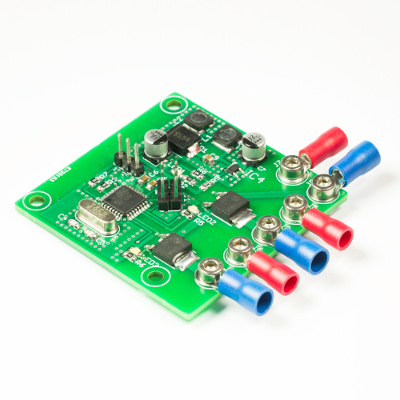

<a href="https://lxrobotics.com/"></a>
💾 Battleswitch
===============

[](http://creativecommons.org/licenses/by-nc-sa/4.0/)

# 📸 Image



# 📂 Description

A battleswitch is an electronic module which is responsible for the activation/deactivation of weapon systems in combat robots. More generally spoken, a battleswitch is a module which enables the switching of loads using an ordinary remote control.

The LXRobotics Battleswitch enables the control of up to 2 actuators over a single RC remote control channel. The battleswitch is connected to and powered by the RC receiver over a 3-pin connection like a servo and tolerates a wide input voltage range from 2 to 8 V DC with a maximum current consumption of 75 mA. The internal software state of the battleswitch is visualized via LEDs, which greatly simplifies operation and integration of the battleswitch. The assignment which remote control input signal leads to which actuator output, is performed via firmware versions which are generated by LXRobotics upon request.

**Features**

* 1 Remote control channel switches 2 actuators
* Switching capacity per channel: max. 40 V / 5 A @ 100 °C
* Supply of the battleswitch electronics by the RC receiver - no additional power supply terminal necessary
* Wide input voltage range for electronic supply: 2 - 8 V DC
* Status-LEDs signal the internal software state and the current switching status
* POWER-LED lights up when there the battleswitch is supplied with power
* Failsafe - switching off the actuators in the absence of a valid remote control signal
* Freewheeling diodes available - switching of inductive loads possible
* 3 x M3 holes for stable mounting of the Battleswitch
* Small size: 50 x 50 mm (L x W)

# 🎥 [Video](images/battleswitch_demo.mp4)

# 💻 Build
```bash
sudo apt-get install cmake avr-libc binutils-avr gcc-avr avrdude
git clone https://github.com/lxrobotics/Battleswitch && cd Battleswitch/software
mkdir build && cd build
cmake ..
make
```
